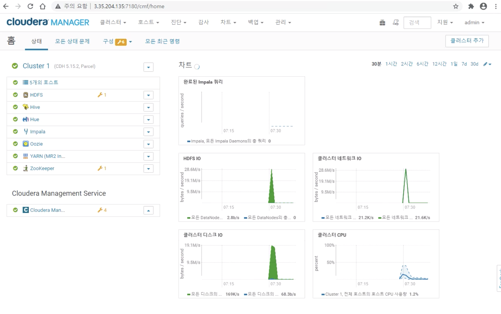

# Cloudera Manager Install Lab

## Preparation to Install
## 1. 접속
Host1 : ssh -i SKCC_Final.pem centos@3.35.204.135

Host2 : ssh -i SKCC_Final.pem centos@3.35.204.162

Host3 : ssh -i SKCC_Final.pem centos@3.35.204.163

Host4 : ssh -i SKCC_Final.pem centos@3.35.204.249

Host5 : ssh -i SKCC_Final.pem centos@3.35.204.93

## 2. 환경 세팅
호스트 세팅

sudo hostnamectl set-hostname [node-name].bdai.com

sudo vi /etc/hosts

10.0.0.251  cm.bdai.com cm
10.0.0.151  m1.bdai.com m1
10.0.0.57   d1.bdai.com d1
10.0.0.84  d2.bdai.com d2
10.0.0.6  d3.bdai.com d3
세팅 후 재접속

yum 업데이트

sudo yum update

## 3. System Configuration Checks
### 1. Check vm.swappiness on all your nodes
cat /proc/sys/vm/swappiness

Set the value to 1 if necessary

sudo vi /etc/sysctl.conf -> vm.swappiness=1

sudo sysctl -w vm.swappiness=1

### 2. Show the mount attributes of your volume(s)
cat /proc/mounts

### 3. If you have ext-based volumes, list the reserve space setting
cat /etc/fstab

### 4. Disable transparent hugepage support
transparent hugepage가 enable 되어있는지 확인

cat /sys/kernel/mm/transparent_hugepage/enabled

sudo vi /etc/rc.d/rc.local

touch /var/lock/subsys/local
echo "never" > /sys/kernel/mm/transparent_hugepage/enabled
echo "never" > /sys/kernel/mm/transparent_hugepage/defrag
sudo chmod +x /etc/rc.d/rc.local

sudo vi /etc/default/grub -> transparent_hugepage=never (on line GRUB_CMDLINE_LINUX )

sudo grub2-mkconfig -o /boot/grub2/grub.cfg sudo systemctl start tuned sudo tuned-adm off

sudo tuned-adm list sudo systemctl stop tuned

sudo systemctl disable tuned

### 5. List your network interface configuration
ifconfig -a

### 6. Show that forward and reverse host lookups are correctly resolved
getent hosts

### 7. Show the nscd service is running
Install nscd service

sudo yum install -y nscd

Run nscd service

sudo systemctl start nscd

sudo systemctl enable nscd

Check the nscd service is running

sudo systemctl status nscd

### 8. Show the ntpd service is running
Install ntpd service

sudo yum install -y ntp

Run ntpd service

sudo systemctl start ntpd

sudo systemctl enable ntpd

Check the ntpd service is running

sudo systemctl status ntpd

## Path B install using CM 5.15.x
### 1. Configure a Repository for Cloudera Manager
모든 서버에 설치

sudo yum install -y wget

sudo vi /etc/yum.repos.d/cloudera-manager.repo

[cloudera-manager]
name = Cloudera Manager, Version 5.15.2
baseurl = https://archive.cloudera.com/cm5/redhat/7/x86_64/cm/5.15.2/
gpgkey = https://archive.cloudera.com/redhat/cdh/RPM-GPG-KEY-cloudera
gpgcheck = 1
sudo rpm --import https://archive.cloudera.com/cm5/redhat/7/x86_64/cm/RPM-GPG-KEY-cloudera

### 2. Install a supported Oracle JDK
모든 서버에 설치

#### 1. 자바 설치
sudo yum install -y java-1.8.0-openjdk-devel

#### 2. 자바 홈 환경 변수 추가
sudo vi /etc/profile

export JAVA_HOME=/usr/lib/jvm/java-1.8.0-openjdk/jre
export PATH=$PATH:$JAVA_HOME/bin
세팅 후 재접속

### 3. Install a supported JDBC Connector
모든 서버에 설치

wget https://dev.mysql.com/get/Downloads/Connector-J/mysql-connector-java-5.1.49.tar.gz

tar zxvf mysql-connector-java-5.1.46.tar.gz

sudo mkdir -p /usr/share/java/

cd mysql-connector-java-5.1.46

sudo cp mysql-connector-java-5.1.46-bin.jar /usr/share/java/mysql-connector-java.jar

### 4. Install Databases (MariaDB)
CM 서버에 설치

sudo yum install mariadb-server

sudo systemctl stop mariadb

sudo vi /etc/my.cnf

[mysqld]
datadir=/var/lib/mysql
socket=/var/lib/mysql/mysql.sock
transaction-isolation = READ-COMMITTED
# Disabling symbolic-links is recommended to prevent assorted security risks;
# to do so, uncomment this line:
symbolic-links = 0
# Settings user and group are ignored when systemd is used.
# If you need to run mysqld under a different user or group,
# customize your systemd unit file for mariadb according to the
# instructions in http://fedoraproject.org/wiki/Systemd

key_buffer = 32M
# (deprecated) key_buffer_size = 32M
max_allowed_packet = 32M
thread_stack = 256K
thread_cache_size = 64
query_cache_limit = 8M
query_cache_size = 64M
query_cache_type = 1

max_connections = 550
#expire_logs_days = 10
#max_binlog_size = 100M

#log_bin should be on a disk with enough free space.
#Replace '/var/lib/mysql/mysql_binary_log' with an appropriate path for your
#system and chown the specified folder to the mysql user.
log_bin=/var/lib/mysql/mysql_binary_log

#In later versions of MariaDB, if you enable the binary log and do not set
#a server_id, MariaDB will not start. The server_id must be unique within
#the replicating group.
server_id=1

binlog_format = mixed

read_buffer_size = 2M
read_rnd_buffer_size = 16M
sort_buffer_size = 8M
join_buffer_size = 8M

# InnoDB settings
innodb_file_per_table = 1
innodb_flush_log_at_trx_commit  = 2
innodb_log_buffer_size = 64M
innodb_buffer_pool_size = 4G
innodb_thread_concurrency = 8
innodb_flush_method = O_DIRECT
innodb_log_file_size = 512M

[mysqld_safe]
log-error=/var/log/mariadb/mariadb.log
pid-file=/var/run/mariadb/mariadb.pid

#
# include all files from the config directory
#
!includedir /etc/my.cnf.d
sudo systemctl enable mariadb

sudo systemctl start mariadb

sudo /usr/bin/mysql_secure_installation

[...]
Enter current password for root (enter for none):
OK, successfully used password, moving on...
[...]
Set root password? [Y/n] Y
New password:
Re-enter new password:
[...]
Remove anonymous users? [Y/n] Y
[...]
Disallow root login remotely? [Y/n] N
[...]
Remove test database and access to it [Y/n] Y
[...]
Reload privilege tables now? [Y/n] Y
[...]
All done!  If you've completed all of the above steps, your MariaDB
installation should now be secure.

Thanks for using MariaDB!
password : 1234

### 5. Create the databases and access grants you will need
mysql -u root -p

CREATE DATABASE scm DEFAULT CHARACTER SET utf8 DEFAULT COLLATE utf8_general_ci;

GRANT ALL ON scm.* TO 'scm'@'%' IDENTIFIED BY '1234';

CREATE DATABASE amon DEFAULT CHARACTER SET utf8 DEFAULT COLLATE utf8_general_ci;

GRANT ALL ON amon.* TO 'amon'@'%' IDENTIFIED BY '1234';

CREATE DATABASE rman DEFAULT CHARACTER SET utf8 DEFAULT COLLATE utf8_general_ci;

GRANT ALL ON rman.* TO 'rman'@'%' IDENTIFIED BY '1234';

CREATE DATABASE hue DEFAULT CHARACTER SET utf8 DEFAULT COLLATE utf8_general_ci;

GRANT ALL ON hue.* TO 'hue'@'%' IDENTIFIED BY '1234';

CREATE DATABASE metastore DEFAULT CHARACTER SET utf8 DEFAULT COLLATE utf8_general_ci;

GRANT ALL ON metastore.* TO 'hive'@'%' IDENTIFIED BY '1234';

CREATE DATABASE sentry DEFAULT CHARACTER SET utf8 DEFAULT COLLATE utf8_general_ci;

GRANT ALL ON sentry.* TO 'sentry'@'%' IDENTIFIED BY '1234';

CREATE DATABASE nav DEFAULT CHARACTER SET utf8 DEFAULT COLLATE utf8_general_ci;

GRANT ALL ON nav.* TO 'nav'@'%' IDENTIFIED BY '1234';

CREATE DATABASE navms DEFAULT CHARACTER SET utf8 DEFAULT COLLATE utf8_general_ci;

GRANT ALL ON navms.* TO 'navms'@'%' IDENTIFIED BY '1234';

CREATE DATABASE oozie DEFAULT CHARACTER SET utf8 DEFAULT COLLATE utf8_general_ci;

GRANT ALL ON oozie.* TO 'oozie'@'%' IDENTIFIED BY '1234';

### 6. Install Cloudera Manager Server
CM 서버에 설치

sudo yum install cloudera-manager-daemons cloudera-manager-server

sudo vi /etc/default/cloudera-scm-server

### 7. Set up the Cloudera Manager Database
CM 서버에 설치

sudo /usr/share/cmf/schema/scm_prepare_database.sh mysql scm scm 1234

### 8. Install CDH and Other Software
CM 서버에 설치

sudo systemctl start cloudera-scm-server

sudo tail -f /var/log/cloudera-scm-server/cloudera-scm-server.log

준비 완료 시 출력 : INFO WebServerImpl:com.cloudera.server.cmf.WebServerImpl: Started Jetty server.

http://13.124.143.184:7180 접속 후 admin / admin 으로 로그인

## Install a cluster and deploy CDH

